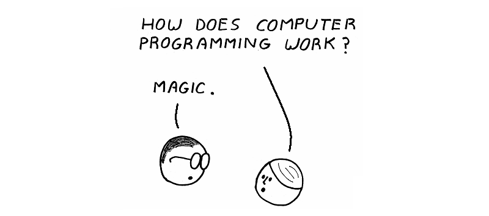

# JavaScript

Les ordinateurs occupent aujourd’hui une place centrale dans nos vies. Ils exécutent une multitude de tâches avec rapidité et précision, qu’il s’agisse de commerce, de santé, d’éducation, de recherche scientifique ou de divertissement. Devenus incontournables, ils sont capables de réaliser des calculs complexes, de traiter et d’interpréter d’immenses volumes de données, mais aussi de nous relier instantanément au reste du monde.

Programmer, c’est concevoir une suite d’instructions : **un programme** 
Ce programme permet de faire exécuter cette suite d'instructions par la machine. Cette activité demande rigueur et précision, car l’ordinateur ne comprend que des directives claires et formelles. Écrire du code peut donc parfois sembler fastidieux, mais c’est cette exigence qui permet d’obtenir des résultats fiables et reproductibles.

Les **langages de programmation** servent d’intermédiaire entre l’humain et la machine. Comme nos langues naturelles, ils utilisent des mots et des structures pour exprimer des concepts. La plupart du temps, ces mots-clés sont en anglais et possèdent un sens évocateur, ce qui permet de rapprocher la logique informatique du langage courant.

Autrefois, interagir avec un ordinateur passait par des langages proches de la machine, comme l'**Assembleur**, le **C**, le **BASIC** ou le **DOS**. Aujourd’hui, ces pratiques ont cédé la place à des interfaces graphiques plus simples d’accès, mais parfois limitées. Pourtant, des langages comme JavaScript ont su évoluer et s’adapter : d’abord cantonnés au navigateur, ils restent au premier plan du développement moderne et continuent d’animer les applications et les interfaces que nous utilisons au quotidien.

## Histoire de JavaScript

**JavaScript** est un langage de programmation **interprété**, dynamique et puissant, essentiel pour le développement web. Il permet de créer des interactions complexes, des animations, et de gérer la communication avec les **serveurs**, rendant ainsi les pages web **interactives** et **fonctionnelles**.

### Les origines (1995)

L’histoire de JavaScript commence en 1995, lorsque **Brendan Eich**, ingénieur chez **Netscape Communications**, développe le langage en seulement dix jours. Netscape souhaitait proposer un langage de script côté client, complémentaire à Java, qui était alors considéré comme un langage lourd et orienté “applications”.

Le projet changea plusieurs fois de nom au fil de son développement. D’abord baptisé **Mocha**, il fut renommé **LiveScript** avant de prendre son appellation définitive, **JavaScript**.

### Pourquoi “JavaScript” ?

Le choix de ce nom fut dicté par des raisons **purement marketing**. En effet, le langage **Java**, créé par Sun Microsystems, bénéficiait alors d’une très forte popularité et d’une campagne publicitaire massive. Pour profiter de cet engouement, Netscape conclut un accord avec Sun afin d’exploiter la marque “Java” et d’associer le nouveau langage à cette image.

Pourtant, **Java et JavaScript n’ont strictement rien en commun sur le plan technique**. Java est un langage compilé, fortement typé et orienté objet, tandis que JavaScript est un langage interprété, faiblement typé et basé sur un modèle prototype.

Lorsque **Oracle** racheta Sun Microsystems en 2009, il hérita du nom “Java” et donc des droits liés à l’appellation “JavaScript”. Toutefois, le véritable nom officiel du langage reste **ECMAScript**, même si le terme “JavaScript” demeure largement utilisé dans la pratique.

### Standardisation (1997)

En 1997, afin de prévenir la fragmentation entre navigateurs (Netscape proposant JavaScript et Microsoft sa propre implémentation baptisée JScript), le langage fut soumis à la normalisation par l’**ECMA (European Computer Manufacturers Association)**. C’est à cette occasion qu’il prit officiellement le nom d’**ECMAScript**.

Ce processus de standardisation a joué un rôle crucial pour assurer la compatibilité entre les différentes implémentations du langage et stabiliser son évolution.

### Les guerres des navigateurs (1995-2005)

La fin des années 1990 fut marquée par une véritable guerre entre **Netscape Navigator** et **Internet Explorer**. Chaque navigateur ajoutait ses propres fonctionnalités JavaScript non standardisées, ce qui provoquait une fragmentation massive. Les développeurs devaient écrire un code spécifique pour chaque navigateur, ce qui complexifiait énormément le développement web.

C’est dans ce contexte que la standardisation ECMAScript devint indispensable.

### L’évolution du langage

La première version largement adoptée fut **ES3**, publiée en 1999, qui permit de stabiliser le langage mais montra rapidement ses limites face à la complexité croissante des applications web.

En **2009**, l’édition **ES5** marqua un tournant décisif. Elle introduisit le “strict mode”, des méthodes modernes de manipulation d’objets et de tableaux (`forEach`, `map`, `filter`) ainsi que la gestion native du JSON. Cette même année, la sortie de **Node.js** donna une seconde vie à JavaScript en lui permettant de s’exécuter côté serveur.

En **2015**, l’arrivée d’**ES6** (aussi appelée ES2015) transforma JavaScript en un langage moderne. Cette édition apporta des nouveautés majeures : les mots-clés `let` et `const`, les **fonctions fléchées**, les **classes**, la gestion des **modules import/export**, les **promises**, les **templates littéraux**, le **destructuring** ou encore la boucle `for…of`. Cette évolution consacra le passage de JavaScript, autrefois perçu comme un langage de script limité, à un véritable langage de programmation robuste et structuré.

Depuis 2015, de nouvelles éditions d’ECMAScript sont publiées chaque année, chacune apportant des améliorations incrémentales et renforçant encore la maturité du langage.

### Node.js et l’ouverture côté serveur (2009)

L’apparition de **Node.js** en 2009, reposant sur le moteur V8 de Google Chrome, permit à JavaScript de sortir du navigateur. Il devint alors possible de développer des applications côté serveur, de manipuler des fichiers, de construire des API ou même de créer des outils en ligne de commande.

Grâce à Node.js, JavaScript ne se limita plus au développement front-end : il devint un langage **full-stack**, utilisé aussi bien côté client que côté serveur.

### L’écosystème moderne

À partir des années 2010, JavaScript s’imposa comme le **pilier central du développement web**. Autour de lui gravitait désormais un écosystème riche et varié. Les frameworks front-end comme **React**, **Angular** et **Vue.js** donnèrent naissance à des applications dynamiques et sophistiquées. Côté mobile, des technologies comme **React Native** et **Ionic** permirent de créer des applications hybrides. Sur desktop, **Electron** ouvrit la voie à des logiciels multiplateformes.

En parallèle, l’écosystème back-end continua de s’élargir avec **Express** ou **NestJS**, consolidant la place de JavaScript dans les architectures modernes. Il devint le cœur de stacks populaires comme **MERN** (MongoDB, Express, React, Node) et **MEAN** (MongoDB, Express, Angular, Node).

### Aujourd’hui

JavaScript est désormais **incontournable**. Il reste le seul langage universellement reconnu par tous les navigateurs et il est utilisé aussi bien côté client que côté serveur. Soutenu par une communauté mondiale immense et dynamique, il évolue sans cesse grâce aux mises à jour régulières d’ECMAScript.

De langage improvisé en dix jours, il est devenu un langage universel et polyvalent, central dans l’expérience utilisateur et moteur de l’innovation web contemporaine.

---

## À retenir

- Un **programme** est une suite d’instructions exécutées par un ordinateur.  
- Les **langages de programmation** servent de passerelle entre l’humain et la machine.  
- **JavaScript** est un langage moderne, central dans le développement web et les navigateurs.  

---
➡️ [Chapitre suivant : Typographie et conventions](./b_Typographie.md)